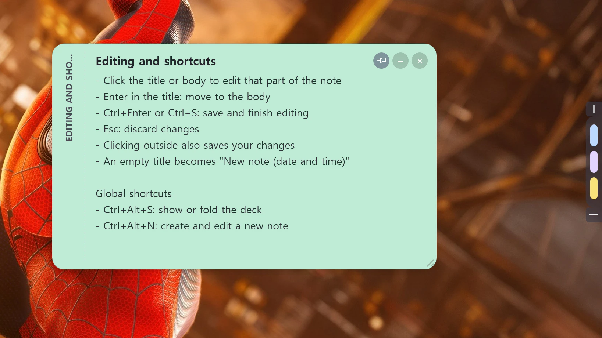
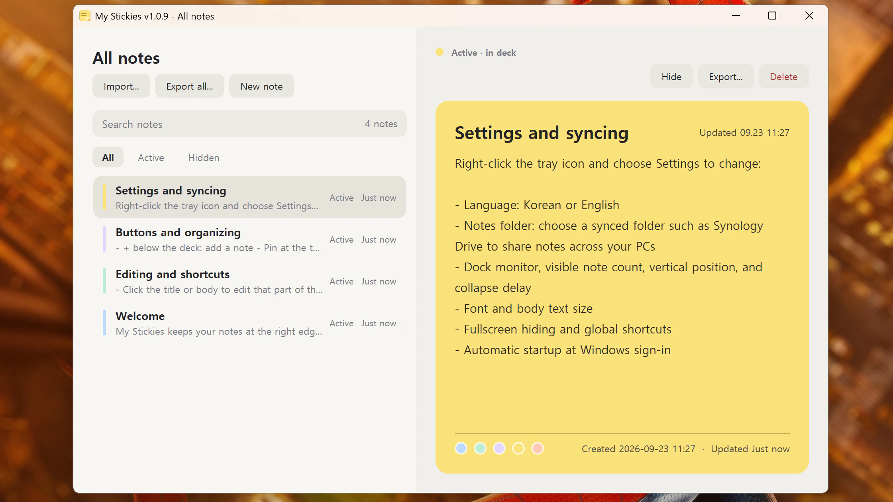

# My Stickies

[한국어](README.md) | [English](README.en.md) | [简体中文](README.zh-CN.md) | [日本語](README.ja.md)

Windows の画面右端に配置する付箋アプリ。macOS アプリ [Hold My Notes](https://holdmynotes.app/) の操作感を参考にしています。

普段は細いしおりとして収納され、マウスを重ねるとメモ一覧が開きます。メモにマウスを重ねると内容が表示され、クリックすると編集できます。

スクリーンショットは現在、英語版のものを使用しています。






## 主な機能

- 韓国語・英語・簡体字中国語・日本語に対応。初回起動時に選択でき、設定から再起動せずに変更可能
- しおり、メモのタブ、展開した本文の 3 段階で表示
- クリックしてタイトルや本文を編集。色の変更と、内容に応じた高さの自動調整
- メモを最前面のフローティングウィンドウとして固定。左側の帯で移動、端でサイズ変更。固定状態・位置・手動で変更したサイズを再起動後に復元
- 削除せずにメモを隠す機能、再クリックによる削除確認、ドラッグによる並べ替え
- 「すべてのメモ」で検索、絞り込み、編集、再表示、Markdown・テキストのエクスポートとインポート
- SQLite に保存。Synology Drive などの同期フォルダーも指定可能
- トレイアイコン、グローバルショートカット、全画面アプリの検出、Windows サインイン時の自動起動
- GitHub のリリース確認とインストーラーによる更新
- モニター、表示枚数、位置、折りたたむまでの時間、フォント、文字サイズを設定可能
- 4K を含む高 DPI ディスプレイに対応（PerMonitorV2）

## 動作環境

- Windows 10 または 11、x64
- 開発環境：.NET 9 SDK
- 発行済みの実行ファイルには .NET ランタイムが含まれるため、別途インストール不要

## ビルドと実行

リポジトリのルートで実行：

```powershell
# ビルド
dotnet build MyStickies.sln -c Release

# 単体テストと回帰テスト
dotnet test tests\MyStickies.Tests\MyStickies.Tests.csproj -c Release

# 実際に公開せずリリーススクリプトを検証
pwsh -NoProfile -File .\tests\ReleaseScript.Tests.ps1

# ソースから実行
dotnet run --project src\MyStickies -c Release
```

任意の起動引数：

| 引数 | 動作 |
|---|---|
| `--all-notes` | 起動時に「すべてのメモ」を開く |
| `--settings` | 起動時に「設定」を開く |

## 実行ファイルの発行

```powershell
pwsh .\publish.ps1
pwsh .\publish.ps1 -Run
pwsh .\publish.ps1 -Output D:\Apps\MyStickies
```

- Release 構成、win-x64 向けの単一実行ファイルとして発行。 .NET ランタイムを同梱
- 既定の出力先：`%LocalAppData%\Programs\MyStickies\MyStickies.exe`
- 発行前に、実行中の My Stickies プロセスを終了
- サインイン時の自動起動は発行済みアプリから有効にすること。ビルド先のアプリを登録すると、そのフォルダーを削除した際に起動できなくなる場合あり

## インストーラーの作成

Inno Setup をインストールしてからビルド：

```powershell
winget install JRSoftware.InnoSetup
pwsh .\build-installer.ps1
pwsh .\build-installer.ps1 -Install
```

出力先は `dist\MyStickies-Setup-<バージョン>.exe`。任意の `-Install` オプションを付けると、ビルド後にサイレントインストールを実行します。

- 管理者権限なしで、現在のユーザーの `%LocalAppData%\Programs\MyStickies` にインストール
- スタートメニューのショートカットを作成。デスクトップのショートカットとサインイン時の自動起動は選択可能
- インストール前に実行中のアプリを終了
- アンインストール後もメモと設定を保持。`%LocalAppData%\MyStickies` と選択したメモのフォルダーのデータも残る
- 実行ファイルはコード署名されていないため、他の PC では Windows SmartScreen の警告が表示される場合あり

## GitHub リリースの公開

GitHub CLI をインストールし、`gh auth login` でログインしてください。バージョン更新を含む変更をコミット・プッシュしてから実行：

```powershell
.\build-installer.ps1
.\release.ps1 1.0.10 "Add Simplified Chinese and Japanese language support"
```

- 第 1 引数はバージョン、第 2 引数はリリースの説明
- バージョンはプロジェクトのバージョンと一致する必要あり
- `v1.0.10` のリリースを作成し、`dist\MyStickies-Setup-1.0.10.exe` を添付して最新リリースに指定
- 現在のコミットをタグの対象とするため、事前に GitHub へプッシュが必要
- インストーラーがない場合、未コミットの変更がある場合、公開に失敗した場合は停止
- コマンドの説明：[GitHub CLI — gh release create](https://cli.github.com/manual/gh_release_create)

## 使い方

### 言語

初回起動時に 한국어、English、简体中文、日本語のいずれかを選び、その後メモのフォルダーを指定します。後から変更する場合は、トレイアイコンを右クリックして「設定」を開き、言語を選んで「OK」を押してください。メニューと開いているウィンドウにすぐ反映されます。

言語はこの PC に保存され、次回起動時も使用されます。言語が指定されていない旧版の設定では韓国語を維持します。言語を変更しても、既存のメモは翻訳・置換されません。新しいメモの既定タイトルと新しく作成される使い方のメモには、選択した言語を使用します。

### メモ一覧

| 操作 | 動作 |
|---|---|
| しおりにマウスを重ねる | メモのタブを表示 |
| しおりの上のハンドルをドラッグ | しおりを移動し位置を保存。一覧に 1 枚以上ある場合に使用可能 |
| しおりの下のボタンをクリック | しおりと一覧を隠す。トレイアイコンやグローバルショートカットで再表示 |
| メモのタブにマウスを重ねる | タイトルと本文を展開 |
| メモをクリック | タイトルや本文を編集 |
| メモを上下にドラッグ | 並べ替え |
| マウスを離す | 設定した時間の後に折りたたむ |
| しおりやメモを右クリック | 「すべてのメモ」「設定」「メモ一覧を隠す・表示」「終了」のメニューを開く |

「メモ一覧を隠す」は、しおりと一覧を一時的に非表示にします。トレイアイコンのクリックやグローバルショートカットで再表示できます。

### メモのボタン

| ボタン | 動作 |
|---|---|
| 一覧の下にある `+` | メモを追加 |
| 右上のピン | 独立したウィンドウとして固定し、残りの一覧を折りたたむ。再クリックで一覧に戻す |
| 右上の `−` | メモを隠す。「すべてのメモ」の「非表示」フィルターから再表示可能 |
| 右上の `×` | 削除確認状態にする。3 秒以内の再クリックで削除を確定 |
| 編集中の色付きの丸 | メモの色を変更 |

固定メモは他のアプリをクリックしても最前面に残ります。左側の帯をドラッグすると移動、右下の角をドラッグすると幅と高さを変更、下端をドラッグすると高さだけを変更できます。手動で変更したサイズは編集中も維持され、収まらない本文はスクロールして読めます。固定状態・位置・手動で変更したサイズは、メモのフォルダーごとにこの PC に保存され、再起動後に復元されます。

固定メモでも編集、非表示、削除が可能です。隠したり削除したりすると、固定も解除されます。

### 編集のショートカット

| キー・操作 | 動作 |
|---|---|
| タイトル欄で Enter | 本文に移動 |
| Ctrl+Enter または Ctrl+S | 保存して編集を終了 |
| Esc | 変更を破棄 |
| 外側をクリック、または別のメモを選択 | 保存して編集を終了 |

日本語を選択している場合、空のタイトルは `新しいメモ (yyyy-MM-dd HH:mm)` になります。

### グローバルショートカット

| キー | 動作 |
|---|---|
| Ctrl+Alt+S | 一覧を表示・折りたたみ |
| Ctrl+Alt+N | 新しいメモを作成して編集 |

他のアプリとキーが競合する場合は、設定で無効にできます。

### すべてのメモ

トレイメニューまたはしおりの右クリックメニューから開きます。

- 「すべて」「表示中」「非表示」で絞り込み、タイトルと本文を検索
- 詳細カードのタイトルや本文をクリックして編集。Esc でキャンセル、Ctrl+Enter で保存、別のメモを選ぶと自動保存
- 詳細カードの下部にある色付きの丸で色を変更
- 選択したメモを隠す、再表示、確認後に削除、エクスポート
- 複数の `.md`・`.txt` ファイルをインポート、すべてのメモを 1 つの Markdown ファイルにエクスポート、メモを追加

### 更新

起動から 15 秒後と 1 日に 1 回、最新の GitHub リリースを確認します。新しいバージョンがあるとトレイで通知し、更新メニューを「更新 vX をインストール」に変更します。

- リリースノートを確認し、「今すぐインストール」「後で」「このバージョンをスキップ」を選択
- 「今すぐインストール」はインストーラーをダウンロードし、アプリを終了して更新後に再起動
- スキップしたバージョンは自動通知の対象外。トレイメニューから手動で確認することは可能
- 設定で自動確認を無効にすると、手動操作時のみ確認

リリースの添付ファイル名は `MyStickies-Setup-*.exe` が必要です。ドラフトとプレリリースは対象外です。

## 保存と同期

- メモは `my_stickies.db` という SQLite ファイルに保存
- 初回起動時に言語と保存先を選択。既定のフォルダーは `%LocalAppData%\MyStickies`
- 保存先は設定から変更可能。既存のデータベースを使用するほか、現在のメモをコピーしたり、使い方のメモを含む新しいファイルを作成したりすることも可能
- 言語、固定メモの位置とサイズなど、この PC 固有の設定は `%LocalAppData%\MyStickies\settings.json` に保存
- Synology Drive や OneDrive などの同期フォルダーで複数の PC 間のメモを共有。外部でファイルが変更されると自動的に再読み込み
- 個人での利用を想定。2 台の PC で同時に編集すると、後から同期した内容が他方を上書きする可能性あり

データベースの構造は `PRAGMA user_version` で管理し、旧形式は起動時に移行します。旧ファイル名 `notes.db` も自動的に `my_stickies.db` に変更します。

## 設定

トレイアイコンを右クリックして「設定」を選択します。

| 項目 | 説明 |
|---|---|
| 言語 | 韓国語、英語、簡体字中国語、日本語。再起動不要 |
| メモのフォルダー | データベースの保存先 |
| 表示するモニター | 一覧を表示するモニター。モニターごとの DPI に対応 |
| 表示枚数 | 一覧に表示する最近のメモの枚数。3～8 枚 |
| 上下の位置 | 一覧の中心位置を画面の高さに対する割合で指定 |
| 折りたたむまで | マウスを離してから折りたたむまでの待ち時間 |
| 全画面使用中に隠す | 同じモニターの前面に全画面アプリがある場合、一覧を隠す |
| グローバルショートカット | Ctrl+Alt+S と Ctrl+Alt+N を有効化 |
| フォントと本文の文字サイズ | システムフォントと 10～24 pt のサイズを選択 |
| 更新の自動確認 | 起動時と毎日、新しいリリースを確認 |
| サインイン時の自動起動 | 現在のユーザーの Run レジストリキーに登録 |

## プロジェクト構成

```text
my_stickies/
  MyStickies.sln
  publish.ps1                  実行ファイルの発行スクリプト
  build-installer.ps1          インストーラー作成スクリプト
  release.ps1                  GitHub リリーススクリプト
  installer/MyStickies.iss     Inno Setup 定義
  src/MyStickies/
    App.xaml(.cs)              アプリリソースと単一起動の制御
    MainWindow.xaml(.cs)       画面端への配置、一覧の展開、並べ替え、設定
    MainWindow.FloatingNotes.cs  固定メモの管理と保存
    Controls/NoteTab           メモカード、編集、アニメーション、色、ボタン
    Windows/                   メモ管理、設定、言語選択、固定メモ、更新
    Data/                      SQLite、メモ保存、設定、出力、自動起動登録
    Layout/                    配置、モニター、フォント、固定ウィンドウの位置
    Localization/              4 言語の文言と実行中の言語切り替え
    Interop/                   Win32 ウィンドウスタイル、DPI、全画面検出、ショートカット
    Tray/                      トレイアイコンとメニュー
    Models/                    メモ、パレット、使い方のメモ、相対時刻
    Assets/app.ico             アプリアイコン
  tests/MyStickies.Tests/       xUnit の単体テストと回帰テスト
  tests/ReleaseScript.Tests.ps1  実際に公開しないリリーススクリプトのテスト
```

## 使用技術

- C#、WPF、.NET 9、Microsoft.Data.Sqlite
- Windows Forms はトレイアイコンのみに使用
- 完全に透明なウィンドウ領域ではクリックが背後に通過。一覧の展開中はほぼ透明な領域でマウスの位置を検知し、カード間や追加ボタン付近でも一覧を開いたまま維持
