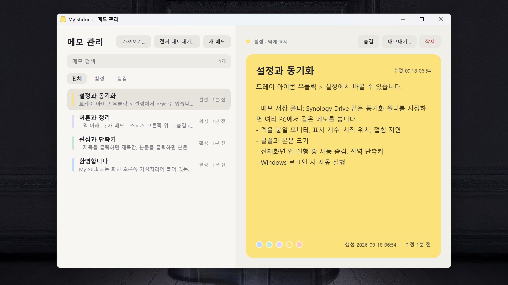

# My Stickies

[한국어](README.md) | [English](README.en.md)

Windows 화면 오른쪽 가장자리에 붙어 있는 스티커 메모 앱. macOS 앱 [Hold My Notes](https://holdmynotes.app/)의 조작감을 Windows에서 재현한 것.

평소에는 얇은 책갈피 모양으로 숨어 있다가, 마우스를 가져가면 메모들이 펼쳐지고, 메모 위에 올리면 내용이 보이며, 클릭하면 바로 편집됨.


<br/>



## 주요 기능

- 한국어·영어 지원: 최초 실행 시 언어 선택, 설정에서 변경하면 열려 있는 창에도 적용
- 우측 가장자리 도킹: 휴면(책갈피) -> 팬아웃(탭 목록) -> 확장(본문) 3단계 애니메이션
- 클릭 편집: 제목칸과 본문칸 개별 편집, 색상 변경, 본문 길이에 따라 카드 높이 자동 조절
- 메모 고정: 우측 상단 핀 버튼으로 독립 창 분리, 다른 앱 위에 계속 표시, 왼쪽 띠를 끌어 이동, 재시작 후 고정 상태와 위치 복원
- 숨김(보관)과 두 단계 삭제, 드래그로 순서 변경
- 메모 관리 창: 전체/활성/숨김 필터, 검색, 미리보기, 복원, 삭제, 내보내기(Markdown/텍스트), 가져오기
- SQLite 파일 저장, 저장 폴더 지정 (Synology Drive 등 동기화 폴더에 두고 여러 PC에서 공유 가능)
- 트레이 아이콘, 전역 단축키, 전체화면 앱 실행 중 자동 숨김, Windows 로그인 시 자동 실행
- GitHub 릴리스 기반 자동 업데이트 확인과 원클릭 설치
- 도킹 모니터 선택, 덱 표시 개수/위치/접힘 지연, 글꼴과 크기 설정
- 4K 고DPI 환경(PerMonitorV2) 대응

## 요구 사항

- Windows 10/11 (x64)
- 개발: .NET 9 SDK
- 실행: 게시된 단일 exe는 런타임을 포함하므로 별도 설치 불필요

## 빌드와 실행

```powershell
cd G:\project\my_stickies

# 빌드 (Release)
dotnet build MyStickies.sln -c Release

# 테스트
dotnet test tests\MyStickies.Tests\MyStickies.Tests.csproj -c Release

# 개발 중 실행
dotnet run --project src\MyStickies -c Release
```

검증용 시작 인자

| 인자 | 동작 |
|---|---|
| `--all-notes` | 시작하자마자 메모 관리 창을 엶 |
| `--settings` | 시작하자마자 설정 창을 엶 |

## 게시 (배포용 exe)

```powershell
pwsh .\publish.ps1          # 게시만
pwsh .\publish.ps1 -Run     # 게시 후 실행
pwsh .\publish.ps1 -Output D:\Apps\MyStickies   # 다른 폴더로 게시
```

- Release, win-x64, .NET 런타임 포함 단일 exe로 게시
- 기본 출력 위치: `%LocalAppData%\Programs\MyStickies\MyStickies.exe`
- 실행 중인 인스턴스가 있으면 자동으로 종료한 뒤 게시
- 자동 실행 등록은 게시된 exe에서 하는 것을 권장 (빌드 출력 폴더의 exe를 등록하면 정리 시 깨질 수 있음)

## 설치 파일 만들기 (Inno Setup)

```powershell
winget install JRSoftware.InnoSetup      # 최초 1회
pwsh .\build-installer.ps1                # dist\MyStickies-Setup-<버전>.exe 생성
pwsh .\build-installer.ps1 -Install       # 생성 후 조용히 설치 (검증용)
```

- 사용자별 설치(관리자 권한 불필요), 설치 폴더는 `%LocalAppData%\Programs\MyStickies`
- 시작 메뉴 바로 가기, 선택 항목으로 바탕 화면 바로 가기와 로그인 시 자동 실행
- 실행 중인 앱은 설치 전에 자동 종료
- 제거해도 메모 데이터와 설정(`%LocalAppData%\MyStickies`, 지정한 저장 폴더)은 남음
- 코드 서명이 없으므로 다른 PC에서는 SmartScreen 경고가 뜰 수 있음 ("추가 정보 > 실행")

## GitHub Release 게시

GitHub CLI 설치와 `gh auth login`을 완료한 뒤, 버전 변경을 포함한 코드를 커밋·푸시하고 실행함.

```powershell
.\build-installer.ps1
.\release.ps1 1.0.9 "고정 메모 크기 조절 지원"
```

- 첫 번째 인자는 버전, 두 번째 인자는 릴리스 본문이며 프로젝트 버전과 일치해야 함
- `dist\MyStickies-Setup-1.0.9.exe`를 첨부한 `v1.0.9` 릴리스를 생성하고 최신 릴리스로 지정함
- 현재 커밋을 태그 대상으로 사용하므로 먼저 해당 커밋을 GitHub에 푸시해야 함
- 설치 파일 누락, 미커밋 변경 사항, 게시 오류 발생 시 중단함
- 동작 기준: [GitHub CLI의 gh release create 문서](https://cli.github.com/manual/gh_release_create)

## 사용법

### 언어 선택

최초 실행 시 한국어 또는 English를 선택한 뒤 메모 저장 폴더를 지정함.
트레이 아이콘 우클릭 > 설정 > 언어에서 변경하고 확인을 누르면 메뉴와 열려 있는 창에 즉시 적용됨.
언어는 이 PC의 설정에 저장되며 재시작 후에도 유지됨. 기존 설치의 언어 기본값은 한국어임.
작성된 메모의 제목과 본문은 변경하지 않으며, 새 메모의 기본 제목과 최초 안내 메모에 선택한 언어를 적용함.

### 덱 조작

| 동작 | 결과 |
|---|---|
| 책갈피에 마우스 올림 | 메모 탭이 펼쳐짐 |
| 책갈피 위 손잡이를 위아래로 드래그 | 책갈피 위치 이동 및 저장. 메모가 1개 이상일 때 표시됨 |
| 책갈피 바로 아래 감춤 버튼 클릭 | 책갈피와 덱을 감춤. 트레이 아이콘이나 전역 단축키로 다시 표시 가능 |
| 탭에 마우스 올림 | 카드가 확장되어 제목과 본문 표시 |
| 카드 클릭 | 편집 모드 (제목 클릭 시 제목칸, 그 외 본문칸) |
| 카드를 위아래로 드래그 | 순서 변경 |
| 마우스를 치움 | 지연 시간 후 접힘 |
| 책갈피 또는 카드 우클릭 | 메모 관리, 설정, 감추기/보이기, 종료 메뉴 |
| 감추기 / 보이기 | 책갈피와 덱을 잠시 숨기거나 다시 표시. 트레이 아이콘 메뉴에서도 가능하며, 감춘 상태에서 트레이 아이콘 좌클릭이나 전역 단축키를 쓰면 다시 보임 |

### 카드 버튼

| 버튼 | 동작 |
|---|---|
| `+` (덱 아래) | 새 메모 추가 |
| 핀 (카드 우측 상단) | 메모를 고정 창으로 분리하고 나머지 덱을 접음. 다시 누르면 고정 해제 후 덱으로 복귀함 |
| `−` (카드 우측 상단) | 숨김. 덱에서 빠지고 메모 관리 창의 "숨김"에서 복원 가능 |
| `×` (카드 우측 상단) | 삭제. 3초 안에 한 번 더 눌러야 실제 삭제 |
| 색상 점 (편집 중 하단) | 카드 색 변경 |

고정 메모는 다른 앱을 클릭해도 화면 위에 남으며, 왼쪽 띠를 끌어 위치를 옮길 수 있음.
오른쪽 아래 모서리를 끌면 가로·세로 크기를, 아래쪽 테두리를 끌면 높이를 조절할 수 있음.
직접 조절한 크기는 편집 중에도 유지되며, 넘치는 본문은 스크롤하여 확인할 수 있음.
고정 상태와 위치, 직접 조절한 크기는 메모 저장 폴더별로 이 PC에 저장되어 앱 재시작 시 복원됨.
고정 창에서도 편집·숨김·삭제가 가능하며, 숨기거나 삭제하면 고정도 해제됨.

### 편집 단축키

| 키 | 동작 |
|---|---|
| Enter (제목칸) | 본문칸으로 이동 |
| Ctrl+Enter, Ctrl+S | 저장하고 편집 종료 |
| Esc | 변경 취소 |
| 바깥 클릭, 다른 카드 클릭 | 저장하고 편집 종료 |

제목을 비우면 `새 메모 (yyyy-MM-dd HH:mm)` 형식의 기본 제목이 붙음.

### 전역 단축키

| 키 | 동작 |
|---|---|
| Ctrl+Alt+S | 덱 열기/닫기 |
| Ctrl+Alt+N | 새 메모를 만들고 바로 편집 |

다른 프로그램과 겹치면 설정에서 끌 수 있음.

### 메모 관리 창

트레이 아이콘 우클릭 또는 덱 우클릭 메뉴의 "메모 관리"로 엶.

- 전체 / 활성 / 숨김 필터와 제목·본문 검색
- 오른쪽 상세 카드에서 제목이나 본문을 클릭하면 바로 편집 (Esc 취소, Ctrl+Enter 저장, 다른 메모를 고르면 자동 저장)
- 상세 카드 하단의 색상 점으로 메모지 색상 변경
- 선택한 메모의 숨김/복원, 삭제(확인 대화상자), 내보내기
- 상단의 가져오기(.md/.txt 여러 파일), 전체 내보내기(Markdown 한 파일), 새 메모

### 자동 업데이트

시작 15초 뒤와 이후 하루 한 번 GitHub 최신 릴리스를 확인함. 새 버전이 있으면 트레이 풍선 알림이 뜨고 트레이 메뉴 항목이 "업데이트 vX 설치..."로 바뀜.

- 항목을 누르면 릴리스 노트와 함께 "지금 설치 / 나중에 / 이 버전 건너뛰기"를 고를 수 있음
- 지금 설치: 설치 파일(`MyStickies-Setup-<버전>.exe`)을 임시 폴더에 받아 조용히 실행하고 앱을 종료. 설치가 끝나면 앱이 자동으로 다시 실행됨
- 건너뛴 버전은 자동 알림에서 제외되지만 트레이 메뉴의 "업데이트 확인..."으로 언제든 다시 볼 수 있음
- 설정의 "새 버전 자동 확인"을 끄면 직접 확인만 가능

릴리스 자산 이름이 `MyStickies-Setup-*.exe` 규칙을 따라야 업데이트 대상으로 인식됨. 초안과 사전 릴리스는 무시함.

## 데이터 위치와 동기화

- 메모는 SQLite 파일 `my_stickies.db` 하나에 저장됨
- 최초 실행 때 언어와 저장 폴더를 물어봄. 기본 저장 위치는 `%LocalAppData%\MyStickies`
- 설정에서 언제든 폴더를 바꿀 수 있음. 새 폴더에 파일이 있으면 그대로 읽고, 없으면 현재 메모를 복사하거나 안내 메모만 든 새 파일로 시작
- 폴더 위치 등 PC별 설정은 `%LocalAppData%\MyStickies\settings.json`에 따로 저장됨
- 동기화 폴더(Synology Drive, OneDrive 등)를 지정하면 여러 PC에서 같은 메모를 사용 가능. 다른 PC에서 파일이 바뀌면 자동으로 다시 읽음
- 단일 사용자 전제. 두 PC에서 동시에 편집하면 나중에 동기화된 쪽이 남음

DB 스키마는 `PRAGMA user_version`으로 관리되며 구버전 파일은 시작 시 자동 마이그레이션됨. 예전 파일 이름 `notes.db`도 자동으로 `my_stickies.db`로 바뀜.

## 설정 항목

트레이 아이콘 우클릭 > 설정

| 항목 | 내용 |
|---|---|
| 언어 | 한국어·영어 선택, 재시작 없이 적용 |
| 메모 저장 폴더 | DB 파일 위치 |
| 덱을 붙일 모니터 | 다중 모니터 중 선택. 모니터별 DPI 반영 |
| 표시 개수 | 덱에 보일 최근 메모 수 (3~8) |
| 시작 위치 | 화면 위에서 몇 % 지점부터 덱이 시작할지 |
| 접힘 지연 | 마우스가 벗어난 뒤 접히기까지 시간 |
| 전체화면 앱 숨김 | 같은 모니터에서 전체화면 앱이 앞에 있으면 덱 숨김 |
| 전역 단축키 | Ctrl+Alt+S, Ctrl+Alt+N 사용 여부 |
| 글꼴 / 본문 크기 | 시스템 글꼴 중 선택, 10~24pt |
| Windows 로그인 시 자동 실행 | HKCU Run 키 등록 |

## 프로젝트 구조

```
my_stickies/
  MyStickies.sln
  publish.ps1              게시 스크립트
  build-installer.ps1      설치 파일 생성 스크립트
  release.ps1              GitHub Release 게시 스크립트
  installer/MyStickies.iss Inno Setup 설치 스크립트
  PLAN.md                  개발 계획과 진행 상황
  src/MyStickies/
    App.xaml(.cs)          앱 리소스(글꼴/크기), 단일 인스턴스
    MainWindow.xaml(.cs)   도킹 창, 덱 상태 전환, 드래그, 설정 적용
    Controls/NoteTab       카드 한 장: 애니메이션, 편집, 색상, 버튼
    Windows/               메모 관리 창, 설정 창
    Data/                  SQLite 저장소, NoteStore, 설정, 내보내기, 자동 실행
    Layout/                덱 배치 계산, 모니터 정보, 글꼴 설정
    Interop/               Win32: 도구 창, DPI, 전체화면 감지, 전역 단축키
    Tray/                  트레이 아이콘
    Models/                Note, 팔레트, 안내 메모, 상대 시각
    Localization/          한국어·영어 문구와 실행 중 언어 전환
    Assets/app.ico         앱 아이콘
  tests/MyStickies.Tests/  xunit 단위 테스트
```

## 기술

- C# / WPF / .NET 9, Microsoft.Data.Sqlite
- 트레이 아이콘만 WinForms NotifyIcon 사용
- 투명 창의 알파 0 영역은 클릭이 아래 창으로 통과되며, 팬아웃 중에는 보이지 않는 호버 영역으로 마우스를 붙잡아 둠
